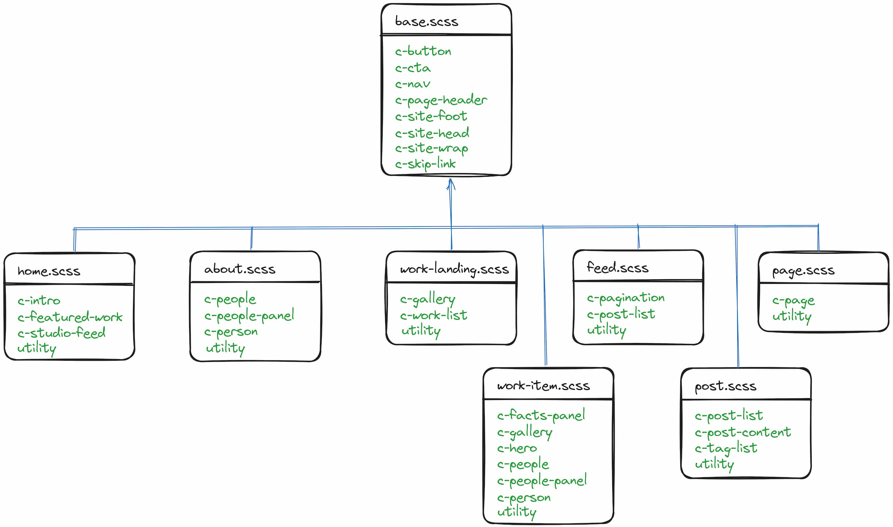

# CSS Architecture

The [Learn Eleventy From Scratch](https://learneleventyfromscratch.com/) course uses [CUBE CSS](cube.fyi). The “U” stands for “Utility”: A **CSS class that does one job and does that one job well** while “E” stands for “Exception”: Usually, an exception is related to a **state change**.

Contrast this to ITCSS (used at [web.dev](https://github.com/GoogleChrome/web.dev/blob/3ad2c8a3604358734bb053ec6c406c09ab1388ab/src/styles/README.md)) where [utilities **are overrides**](https://www.xfive.co/blog/itcss-scalable-maintainable-css-architecture/#what-is-itcss-). CUBE's utilities lean into [functional CSS](https://www.browserlondon.com/blog/2019/06/10/functional-css-perils/) and Andy Bell has even gone on to adapt CUBE CSS with Tailwind CSS ([_I used Tailwind for the U in CUBE CSS and I liked it_](https://andy-bell.co.uk/i-used-tailwind-for-the-u-in-cube-css-and-i-liked-it/), [demo](https://cube-css-with-tailwind.netlify.app/), [source](https://github.com/Andy-set-studio/CUBE-with-tailwind)).

I've [pondered](https://dev.to/peerreynders/comment/14c8g) Tailwind (and by extension utility-first) CSS at [some length](https://dev.to/peerreynders/comment/14e75) but ultimately decided it was [a trap](https://youtu.be/-cJBt9-W2dQ). I've played this game before. I learned jQuery but eventually had unlearn it and then embrace JavaScript anyway. I put considerable effort into learning AngularJS only to then realize that I still knew nothing about “Web Development”. So this time arround I wasn't going to adopt another tool that projected it's own opinion as “the true way”. Additionally I've come to view Tailwind CSS as [“primitive obsessed”](https://www.informit.com/articles/article.aspx?p=2952392&seqNum=11).

That said the use of [design tokens](https://piccalil.li/tutorial/what-are-design-tokens/) made a _lot_ of sense to me. The course used [Gorko](https://github.com/Andy-set-studio/gorko) to generate utilities from the build time design settings.

## Treat utilities as overrides, options or composable mixins

Given that I planned to embrace [Sass](https://sass-lang.com/) (rather than treat it as a necessary evil) I opted for a far simpler approach. For example Gorko would generate a `measure-long` utitlity (so also [Every Layout: Axioms](https://every-layout.dev/rudiments/axioms/#measure)).

Inside a CSS component I would simply use:

```scss
@use '../setting' as s;

.c-component {
  max-width: s.from-measure('long');
}
```

… instead. So the design values would reside under `src/styles/setting` as `_color.scss`, `_font.scs`, `_measure.scss` and `_size.scss` while functions for access of these values by other sass modules would exist in `index.scss`.

Other more extensive “utilities” like:

```scss
@use '../setting' as s;

@mixin wrapper {
  max-width: 70rem;
  padding: 0 s.from-size('500');
  margin-left: auto;
  margin-right: auto;
  position: relative;
}
```

… would become [mixins](https://sass-lang.com/documentation/at-rules/mixin/) to be `@include`d into a CSS component (`@extend` was rarely used; [When to use `@extend`; when to use a mixin](https://csswizardry.com/2014/11/when-to-use-extend-when-to-use-a-mixin/)).

```scss
@use '../setting' as s;
@use '../utility/mixin' as u;

.c-post-content {
  @include u.page-content;
  @include u.wrapper;
  --u-flow-space: #{s.from-size('700')};
  margin-top: s.from-size('700');
}
```

The directory names `setting`, `generic`, `utility`, and `component` were specified in the singular due to the default naming of [`@use`](https://sass-lang.com/documentation/at-rules/use/) without overiding the namespace.

```scss
@use '../setting';

.u-radius {
  border-radius: setting.$border-radius;
}
```

## Namespace classes

Class names are [namespaced](https://csswizardry.com/2015/08/bemit-taking-the-bem-naming-convention-a-step-further/):

- `c-`: Identifies a _component_ class.
- `u-`: Identifies a _utility_ class (currently there are only `u-flow`, `u-radius`, `u-visually-hidden`, and `u-wrapper`).

## Prefix JavaScript hooks

[JavaScript hooks](https://cssguidelin.es/#javascript-hooks) are prefixed with `js:`. A class name is prefixed when it is referenced by JavaScript or is added and/or removed by it:

```html
<div class="c-dropdown js:c-dropdown js:c-dropdown--open">
  <button class="c-dropdown__toggle js:c-dropdown__toggle">Main Menu</button>
  <div class="c-dropdown__drawer">
    <ul class="c-menu">
      <li><a href="/">Home</a></li>
      <li><a href="/coffees">Coffees</a></li>
      <li><a href="/brewers">Brewers</a></li>
      <li><a href="/specials">Specials</a></li>
      <li><a href="/about">About us</a></li>
    </ul>
  </div>
</div>
```

This acts as a reminder that renaming the class requires modification in the JavaScript codebase to preserve the associated capabilities.

Note the apparent duplication between `c-dropdown` and `js:c-dropdown`. Both of these classes exist for **entirely different purposes**. `c-dropdown` exists as a binding target for the component CSS. `js:c-dropdown` exist as a selection target for the JavaScript that is responsible for adding and removing the `js:c-dropdown--open` modifier.

One downside is that the colon `:` has to be escaped in CSS to differentiate it from a [pseudo-class](https://developer.mozilla.org/en-US/docs/Web/CSS/Pseudo-classes).

In markup the colon doesn't have to be escaped:

```html
<div class="c-dropdown js:c-dropdown"></div>
```

In selectors in CSS source files it has to be escaped:

```css
.c-dropdown.js\:c-dropdown--open .c-dropdown__toggle::after {
  inset-block-start: 0.7em;
  border-color: transparent transparent black;
}
```

In JavaScript strings for selectors the escape character itself has to be escaped:

```JavaScript
const toggle = document.querySelector('.js\\:c-dropdown__toggle');
```

Alternately the [`String.raw`](https://developer.mozilla.org/en-US/docs/Web/JavaScript/Reference/Global_Objects/String/raw) [tagged template](https://developer.mozilla.org/en-US/docs/Web/JavaScript/Reference/Template_literals#tagged_templates) can be used:

```JavaScript
const toggle = document.querySelector(String.raw`.js\:dropdown__toggle`);
```

## Use modifiers instead of data attributes

In CUBE CSS exceptions use [data attributes](https://developer.mozilla.org/en-US/docs/Learn/HTML/Howto/Use_data_attributes)—a practice not that uncommon given the existance of the [attribute selector](https://developer.mozilla.org/en-US/docs/Web/CSS/Attribute_selectors). The practice ignores this [observation](https://cssguidelin.es/#data--attributes):

> A common practice is to use `data-*` attributes as JS hooks, but this is incorrect. `data-*` attributes, as per the spec, are used **\*to store custom data** private to the page or application* (emphasis mine). `data-*` attributes are designed to store data, not be bound to.

[3.2.6.6 Embedding custom non-visible data with the `data-*` attributes](https://html.spec.whatwg.org/multipage/dom.html#embedding-custom-non-visible-data-with-the-data-*-attributes).

The interpretation is that data attributes were designed as data holders to supply additional context for the site's JavaScript, information that isn't derivable from the _standard_ HTML 5 markup alone. Using data attributes as CSS binding (or JS selection) sites (which are more conveniently managed than a single class in a [`classList`](https://developer.mozilla.org/en-US/docs/Web/API/Element/classList)) dilutes their intended purpose given the intent behind the [`class`](https://developer.mozilla.org/en-US/docs/Web/HTML/Global_attributes/class) attribute.

For this reason [modifiers](https://getbem.com/naming/#modifier) are used instead of data attributes. Most of the CUBE CSS exceptions were simply replaced with parameters to a mixin or explicitly setting a component's property to the desired value.

## Use Sass constants where possible; custom properties only when necessary

Wholesale replacement of Sass [variables](https://sass-lang.com/documentation/variables/) with [custom properties](https://developer.mozilla.org/en-US/docs/Web/CSS/Using_CSS_custom_properties) is [misguided](https://dev.to/peerreynders/comment/1mb76); it's equivalent to replacing all `const`s with `let` in JavaScript (also [Don’t do it at runtime. Do it at design time](https://www.freecodecamp.org/news/dont-do-it-at-runtime-do-it-at-design-time-c4f59d1775e4/)).

In most cases Sass variables are entirely sufficient ([Principle of Least Power](https://www.w3.org/DesignIssues/Principles.html?ref=blog.codinghorror.com#PLP)) as the values don't need to change at runtime and are mostly immutable at build time.

Custom properties only become necessary when

- the value of a custom property has to be [modifiable](https://developer.mozilla.org/en-US/docs/Web/CSS/Using_CSS_custom_properties#values_in_javascript) during runtime
- one CSS rule set needs to communicate via [inheritance](https://developer.mozilla.org/en-US/docs/Web/CSS/Using_CSS_custom_properties#inheritance_of_custom_properties) with another rule set bound deeper into the DOM subtree (in a manner that cannot be expressed by passing parameters to a Sass function or mixin)

## Prefer control over convenience

Astro is perfectly capable of [scoped styles](https://docs.astro.build/en/guides/styling/#scoped-styles). However the convenience of collocation comes at the control over the [order of appearance](https://drafts.csswg.org/css-cascade-6/#cascade-order).

> When all else is equal, the last selector wins.

— MDN: [Specificity](https://developer.mozilla.org/en-US/docs/Web/CSS/Specificity#additional_notes)

This is why all the CSS is managed under `src/styles` even at the cost of having to work across `.astro` and `.scss` files (typically this isn't an issue as most editors support side-by-side split pane editing of separate files).

At the highest level the following order of appearance is desired (inpired by [ITCSS](https://youtu.be/1OKZOV-iLj4?t=409)):

- _setting_: design tokens
- _generic_: reset, normalization and other element type level defaults
- _component_: components, i.e. `c-*` classes
- _utility_: utilities, options and overrides, i.e. `u-*` classes

Astro's [CSS import](https://docs.astro.build/en/guides/styling/#import-a-local-stylesheet) is used to inline the CSS into the page's HTML. The included CSS is managed on the layout level. The base layout `base.astro` imports the CSS (`critical.scss`) used by the page header and footer and some other CSS used in most of the pages.

```scss
// file: src/styles/critical.scss
@use 'sass:meta';
@use 'setting' as s;
@use 'generic/anchor' as a;

@include meta.load-css('generic/reset');

// …

// blocks/components
@include meta.load-css('component/_site-wrap');
@include meta.load-css('component/_button');
@include meta.load-css('component/_skip-link');
@include meta.load-css('component/_site-head');
@include meta.load-css('component/_nav');
@include meta.load-css('component/_page-header');
@include meta.load-css('component/_cta');
@include meta.load-css('component/_site-foot');

// … and at the end of the last css import
// to control preferred order of appearance
//
// @include meta.load-css('critical-epilog');
```

To achieve the desired order of appearance `utility` is referenced in a separate `_critical-epilog.scss` file to be included in the CSS import of the nested layout _after_ any additional CSS components are included.

```scss
// file: src/styles/page.scss
@use 'sass:meta';

@include meta.load-css('component/page');
@include meta.load-css('component/people-panel');

// utilities / overrides
@include meta.load-css('critical-epilog');
```

Accordingly the CSS is split across the layout specific files for import by their respective `.astro` layout component.


